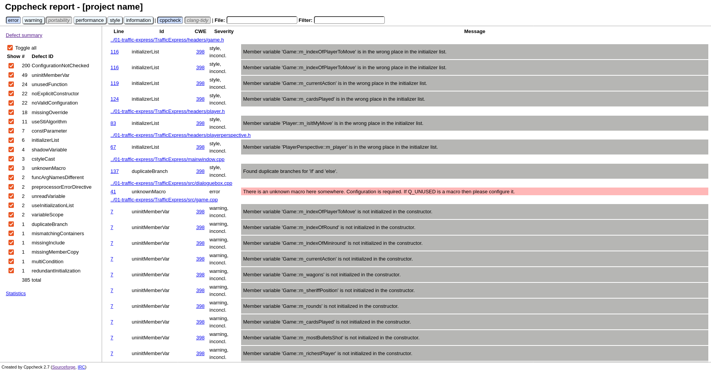
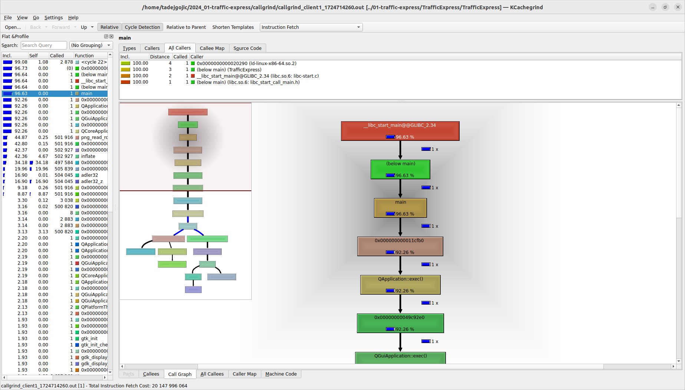
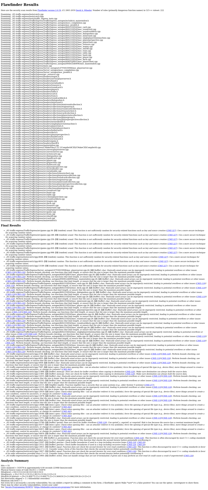

# Izveštaj sprovedene analize

Korišćeni alati:
- [Cppcheck](#cppcheck)
- [ClangTidy](#clang-tidy)
- [Valgrind](#valgrind)
	- [Memcheck](#memcheck)
	- [Callgrind](#callgrind)
 - [Flawfinder](#flawfinder)

## Cppcheck
Cppcheck je alat za statičku analizu C i C++ koda koji se koristi za identifikaciju potencijalnih problema pre nego što se program izvrši. Omogućava programerima da dobiju uvid u kvalitet svog koda i olakšava proces njegove optimizacije. Cppcheck je posebno koristan za otkrivanje curenja memorije, prepoznavanje neinicijalizovanih promenljivih, identifikaciju problema sa pokazivačima i za održavanje konzistentnosti koda.

### Postupak analize
Za cppcheck analizu korišćen je terminal a koraci pokretanja alata opisani u okviru [README.md](cppcheck/README.md).

### Zaključci
Nakon pokretanja skripta `cppcheck.sh` dobijen je detaljan izveštaj u okviru kog možemo videti sva upozorenja sa tačnim mestom u kodu gde su upozorenja pronađena. Izveštaj je prikazan na slici ispod:

Od stilskih upozorenja mozemo primetiti:
1. Promenljiva je na pogresnom mestu u listi pri inicijalizaciji
2. Pronadjeni su duplikati grana (if/else)
3. Argument nema isto ime u deklaraciji i definiciji funkcije

Od upozorenja nailazimo na:
1. Vrednost polja klase nije inicijalizovana u konstruktoru
2. Vrednost polja klase nije dodeljena prilikom kopiranja

Od gresaka imammo sledece:
1. Koristi se nedefinisan makro
2. Iteratori nad razlicitim objektima se koriste zajedno
3. Neuspesna evaluacija if uslova

## ClangTidy
Naravno, evo kako bi opis za Clang-Tidy mogao izgledati u sličnom formatu:

Clang-Tidy je alat za statičku analizu koda koji se koristi za otkrivanje i ispravljanje problema u izvornom kodu u C i C++. Ovaj alat analizira kod i primenjuje pravila i preporuke za poboljšanje kvaliteta koda, otkrivanje grešaka, optimizaciju performansi i usklađivanje sa standardima koda. Clang-Tidy nudi razne "check" opcije koje mogu da obuhvate različite aspekte koda, kao što su stil kodiranja, sigurnost, performanse i druge preporuke za poboljšanje.

Možete konfigurisati Clang-Tidy pomoću fajla .clang-tidy koji definiše skup pravila koja se primenjuju tokom analize. 
Neki od predefinisanih provera koje Clang-Tidy pruža uključuju:

    modernize-*: Preporuke za modernizaciju koda.
    readability-*: Povećanje čitljivosti koda.
    performance-*: Optimizacija performansi.

  
### Postupak analize
Za cppcheck analizu korišćen je terminal a koraci pokretanja alata opisani u okviru [README.md](clang-tidy/README.md).

### Zaključci
Vecina upozorenja u izlaznom fajlu se ne odnose na korisnicki kod, pa su ona potisnuta. 
U korisnickom kodu, najcesce upozorenje koje srecemo je upozorenje za koriscenje `0` ili `NULL` umesto `nullptr`

## Valgrind
Valgrind je programski alat za za dinamičku analizu mašinskog koda. On omogućava automatsko otkrivanje problema sa memorijom i
procesima, što ga čini pogodnim za otkrivanje i ispravljanje grešaka u softverskim aplikacijama. Najčešće se koristi za debugovanje memorije, detekciju curenja memorije i profajliranje. U sklopu analize, koristila sam dva Valgrind alata: `Memcheck` i `Callgrind`.

## Memcheck
Alat Memcheck u okviru Valgrinda je moćan alat koji pomaže u identifikaciji curenja memorije, čitanju neinicijalizovane memorije i otkrivanju drugih grešaka povezanih s upravljanjem memorijom u programima napisanim u C i C++ jeziku. Kroz analizu izvršnih datoteka, Memcheck otkriva probleme koji mogu prouzrokovati nepredvidivo ponašanje programa, pružajući programerima detaljne informacije za poboljšanje stabilnosti i pouzdanosti koda.

Iako je moguće pokrenuti alat i iz QtCreator okruženja, Memcheck sam za analizu koristila preko terminala prateći postupak pokretanja iz [README.md](memcheck/README.md).

### Zaključci
Na osnovu [parsiranih rezultata](memcheck/memcheck_summary.txt) pokretanja alata, mozemo primetiti da pri pokretanju serverske strane nije doslo ni do kakvih greski ili curenja memorije, dok sa klijentske strane primecujemo pojedine izgubljene blokove, kao i pristupanje memoriji van granica bafera.

## Callgrind
Callgrind je alat za profajliranje performansi u programiranju. On se koristi za merenje performansi programa tako što prati broj izvršenih instrukcija, keš pristupa, grananja, kao i druge metrike izvršavanja programa. Callgrind generiše detaljan izveštaj o korišćenju resursa tokom izvršavanja programa, omogućavajući programerima da identifikuju delove koda gde se troše najviše resursa, kao i da pronađu potencijalne tačke za optimizaciju. 

Callgrind sam koristila preko terminala prateći postupak pokretanja iz [README.md](callgrind/README.md).

Za tumačenje izveštaja nam služi pomoćni alat `KCachegrind` koji reprezentuje izveštaj u vizuelnom i interaktivnom formatu. 

Ono što nas zanima su funkcije koje se pozivaju najveći broj puta. Sa leve strane se nalaze informacije o broju pozivanja svake funkcije
i broju instrukcija koje je zahtevalo njeno izvršavanje, samostalno i uključujući izvršavanja drugih funkcija koje je pozivala. Na desnoj
strani možemo izabrati opciju `All Callers` i videćemo koje sve funkcije su pozivale funkciju koja nas zanima. Takodje na dnu sa desne
strane vidimo i graf poziva funkcije koji se dobija odabirom opcije `Call Graph`.
Na osnovu analize datog izveštaja, stiče se utisak da nema velikog broja poziva funkcija u delu koji je implementiran od strane programera ovog projekta.

## Flawfinder
Flawfinder je alat za pronalazak potencijalnih sigurnosnih propusta u izvornom kodu programa pisanih u jezicima C i C++. Flawfinder sadrži bazu funkcija koje su najčešći uzroci sigurnosnih propusta. Pojavljivanje svake od tih funkcija u izvornom kodu prijavljuje se kao
mogući propust.
Uz popis nesigurnih funkcija, Flawfinder prikazuje i nivo rizika. Nivo rizika je celi broj u
intervalu [0, 5], a zacisi, osim od same funkcije, i od njenih argumenata.

Alat Flawfinder pokretan je iz terminala prateći postupak pokretanja iz [README.md](flawfinder/README.md).

Rezultati pokretanja skripte:

Neke od prijavljenih grešaka:
1. **CWE-327: Use of a Broken or Risky Cryptographic Algorithm**: Upozorava da program koristi neispravan ili rizičan kriptografski algoritam ili protokol. Ovo može dovesti do otkrivanja osetljivih informacija, lažiranja identitea, modifikovanja podataka i drugih neželjenih dogadaja. Analiza je ovom propustu dodelila nivo 3.
2. **CWE-119/CWE-120**: Ova upozorenja nam skreću pažnju na to da program radi sa memorijskim baferom bez provere njegove veličine. Kao rešenje, predlaže proveru veličine bafera kako bi se izbeglo čitanje i pisanje van opsega statički alociranog bafera. Analiza je
ovom propustu dodelila nivo 2.
3. **CWE-362**: Upozorava da program sadrži sekvencu koja zahteva privremeni ekskluzivi pristup deljenim podacima, ali da to nije
obezbeđeno. Analiza je ovom propustu dodelila nivo 2.
4. **CWE-377**:  Upozorava na kreiranje i koriscenje nepouzdanih privremenih fajlova, sto moze uciniti sistem osetljivim na napade.
5. **CWE-126**: Dolazi do čitanja vrednosti izvan granica bafera. Ovo se obično dešava kada se pokazivač ili njegov indeks poveća na poziciju van granica bafera, ili kada aritmetika pokazivača rezultira pozicijom izvan validne memorijske lokacije, između ostalog. Ovo može dovesti do izlaganja osetljivih informacija ili potencijalnog rušenja sistema.
6. **CWE-20**: Primaju se ulaz ili podaci, ali ne vrši validacija ili pogrešno validira da ulaz ima svojstva koja su neophodna za sigurno i ispravno procesiranje podataka.
